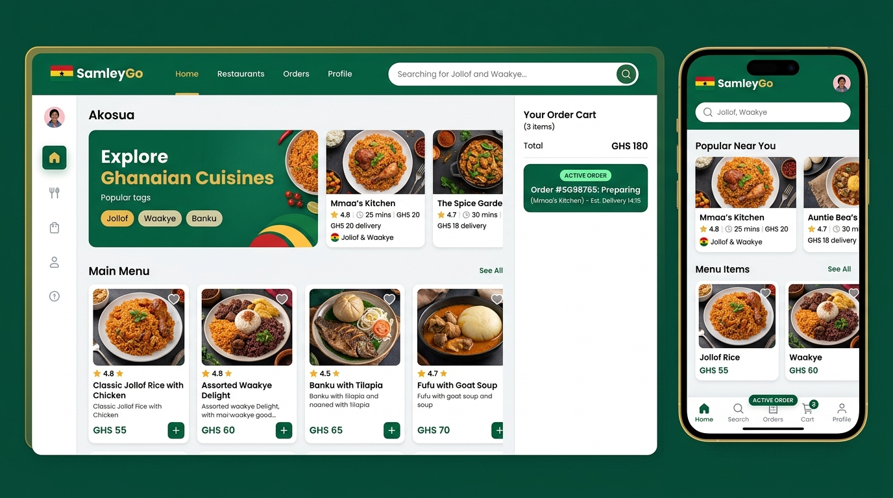
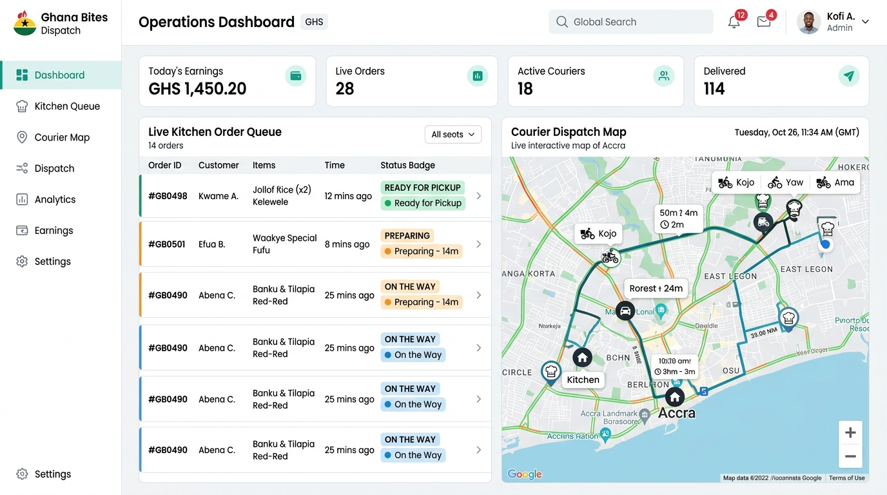

# 🍛 SamleyGo — Ghana Food Delivery SaaS & Installable Mobile PWA

[](https://www.typescriptlang.org/)
[](https://react.dev/)
[](https://vitejs.dev/)
[](https://tailwindcss.com/)
[](https://supabase.com/)
[](https://web.dev/progressive-web-apps/)
[](https://developer.android.com/distribute)

> **SamleyGo** is a full-featured, Ghana-localized food ordering and delivery software platform and installable Progressive Web App (PWA). It bridges the gap between hungry diners, authentic Ghanaian restaurants/chop bars, delivery riders (couriers), and central platform administration with real-time tracking, Mobile Money (MoMo) payments, and live data synchronization powered by Supabase.

---

## 📱 App Screenshots & Visual Preview

### 1. Customer Experience & Real-Time Food Search
*Intuitive discovery of authentic Ghanaian dishes (Jollof Rice, Waakye, Banku & Tilapia, Kelewele), real-time search across kitchens and menus, dynamic cart management, and instant ordering in Ghana Cedis (GHS).*



---

### 2. Multi-Role Operations: Kitchen Dashboard, Courier Dispatch & Admin Analytics
*Real-time operational command center: Restaurant kitchen live order queue, courier delivery dispatch with GPS navigation, and platform performance monitoring.*



---

## 🌟 Core Highlights & Architectural Principles

- **100% Real Supabase Data**: Zero mock data, zero localhost URLs, zero fake arrays. Every dish, restaurant, customer order, courier status, and payment record queries and persists to Supabase PostgreSQL with strict Row Level Security (RLS).
- **Supabase Realtime Engine**: Immediate push notifications and live UI updates across clients when food items are updated, orders are accepted, or delivery statuses change.
- **Ghana-Localized FinTech & Logistics**:
  - Currency: **Ghana Cedi (GH₵ / GHS)**.
  - Payment Gateways: **MTN Mobile Money (MoMo)**, **Telecel Cash (Vodafone)**, **AT Money (AirtelTigo)**, Card, and **Cash on Delivery (COD)**.
  - Localized Address & Geolocation: Ghana Digital Address (e.g. `GA-183-9024`), landmarks, neighborhood routing across Greater Accra, Kumasi, Takoradi, and nationwide.
- **Progressive Web App (PWA) & TWA Ready**:
  - Installable directly to Android and iOS home screens with custom splash screens and offline service worker caching.
  - Formatted for direct Google Play Store publication as a **Trusted Web Activity (TWA)**.

---

## 👥 Multi-Role User Hierarchy

```
                                  ┌────────────────────────┐
                                  │   Super Administrator  │
                                  │ (Platform Governance)  │
                                  └───────────┬────────────┘
                                              │
                     ┌────────────────────────┼────────────────────────┐
                     ▼                        ▼                        ▼
        ┌────────────────────────┐ ┌────────────────────────┐ ┌────────────────────────┐
        │        Customer        │ │    Restaurant Owner    │ │     Courier Rider      │
        │  (Ordering & Tracking) │ │   (Kitchen & Menus)    │ │ (Dispatch & Delivery)  │
        └────────────────────────┘ └────────────────────────┘ └────────────────────────┘
```

1. **Customer**: Browse menus, live search for Ghanaian cuisine, customize dish notes, manage cart, track order live via status timeline, rate meals.
2. **Restaurant Owner**: Manage restaurant profile, add/edit menu items with prices, categories, and photos, toggle dish availability, receive incoming orders in real time, advance cooking states (`CONFIRMED` ➔ `PREPARING` ➔ `READY_FOR_PICKUP`).
3. **Courier Rider**: View available ready orders nearby, accept delivery assignments, view pickup and customer drop-off routes, call customer/restaurant, advance status (`OUT_FOR_DELIVERY` ➔ `DELIVERED`), track cumulative GHS earnings.
4. **Super Admin**: Approve restaurants and couriers, monitor active orders across all cities, inspect platform commission, audit transaction logs.

---

## 🔄 End-to-End System Workflows

### Workflow 1: Authentication & Role-Based Access Control (RBAC)

```
[User Visits SamleyGo]
       │
       ├─► Unauthenticated: Can freely search dishes, explore restaurants, view menus
       │
       └─► Sign In / Register (/login, /register)
              │
              ├── Authenticates via Supabase Auth (email/password)
              ├── Retrieves role from `public.profiles` (`CUSTOMER`, `RESTAURANT_OWNER`, `COURIER`, `SUPER_ADMIN`)
              └── Routes user dynamically to their dedicated dashboard:
                     • Customer         ➔ / (Home) or /restaurants
                     • Restaurant Owner ➔ /restaurant/dashboard
                     • Courier          ➔ /courier/dashboard
                     • Super Admin      ➔ /admin/dashboard
```

#### Courier onboarding — two-section registration

Courier sign-up is split into two sequential sections (customers and kitchens keep the single-section form):

```
[COURIER SELECTED]
   │
   ├── SECTION 1 · Account Details
   │      • Full name, email, Ghana phone number (+233), password
   │      • Validated inline, then "Continue to Verification"
   │
   └── SECTION 2 · Identity & Vehicle Verification
          • Vehicle type + vehicle number plate (e.g. GR-1234-24)
          • Ghana Card ID number (PIN, GHA-123456789-2)
          • Ghana Card photo — FRONT  ┐ compressed in-browser, uploaded to the
          • Ghana Card photo — BACK   ┘ PRIVATE `courier-documents` bucket
          • Driving licence ID number
          • "Submit for Verification" ➔ account created, documents queued for review
```

- Section 1 data is captured as Supabase Auth **user metadata**, so a database trigger (`handle_new_user`) writes the courier row and identity numbers even if the browser never gets a session.
- Section 2 documents are upserted into `public.courier_documents` (the single RLS-protected store for national ID data) and the courier lands with `verification_status = 'PENDING'`.
- The courier cannot go **ONLINE** until a super admin approves them from the admin dashboard — approval flips `is_approved` / `verification_status` and propagates instantly over Supabase Realtime.

- Passwords and auth tokens are secured using Supabase GoTrue authentication.
- Navigation guards (`<ProtectedRoute allowedRoles={[...]} />`) restrict unauthorized access both on client routes and via PostgreSQL Row Level Security (RLS) policies at the database layer.

---

### Workflow 2: Realtime Food & Kitchen Discovery Search

```
User enters query: "Waakye" or "Jollof"
       │
       ├─► Instant Multi-Query to Supabase:
       │      1. `public.menu_items`: Matches dish name OR description (ilike '%query%')
       │      2. `public.restaurants`: Matches name, cuisine type, or address
       │
       ├─► Supabase Realtime Channel Subscription:
       │      • Listens for INSERT, UPDATE, DELETE on `menu_items` and `restaurants`
       │      • If a restaurant changes price or toggles availability, UI updates live without refresh
       │
       └─► Instant Categorized Display:
              ├── "Dishes & Food" tab (direct "Add to Order" with price in GHS)
              └── "Kitchens & Restaurants" tab (opening hours, rating, delivery time)
```

---

### Workflow 3: Order Placement & Checkout Workflow

```
Customer adds items from Restaurant A
       │
       ├─► Cart Validation:
       │      • Enforces single-restaurant ordering (prevents mixing dishes from different kitchens)
       │      • Calculates subtotal, delivery fee (GH₵), and packaging/service charges
       │
       ├─► Checkout Form (/checkout):
       │      • Captures Delivery Address & Ghana Digital Address
       │      • Browser Geolocation integration to pin customer GPS coordinates
       │      • Customer phone number for delivery updates
       │      • Special cooking notes (e.g., "Extra shito on the side", "Mild pepper")
       │      • Selects Payment Method: MTN MoMo, Telecel Cash, AT Money, or Cash on Delivery
       │
       └─► Supabase Atomic Transaction:
              • Inserts record into `public.orders` with unique `order_number` (e.g. `SLG-84920`)
              • Inserts items into `public.order_items`
              • Inserts initial entry into `public.order_status_history` (`PENDING`)
              • Emits Realtime Postgres event to kitchen
```

---

### Workflow 4: Kitchen Order Fulfillment Lifecycle

```
[Order Placed by Customer]
       │
       ▼ (Supabase Realtime triggers sound & notification on Kitchen Dashboard)
[Status: PENDING] ────► Restaurant reviews items & special cooking requests
       │
       ├── Accept Order ────► [Status: CONFIRMED]
       │                            │
       │                            ▼
       │                     Kitchen begins preparation ────► [Status: PREPARING]
       │                                                            │
       │                                                            ▼
       │                     Food packed and ready ─────────► [Status: READY_FOR_PICKUP]
       │                                                            │
       └── Reject Order ────► [Status: CANCELLED]                   │
                                                                    ▼
                                                       Notifies Couriers in Area
```

---

### Workflow 5: Courier Dispatch & Delivery Execution

```
[Order reaches READY_FOR_PICKUP]
       │
       ▼
Broadcasted in real-time to active, online couriers (`public.couriers.availability_status = 'AVAILABLE'`)
       │
       ├─► Courier views distance, pickup restaurant, customer drop-off area, and delivery fee
       │
       ├─► Courier clicks [Accept Delivery]:
       │      • Updates `orders.courier_id` to current courier's UUID
       │      • Updates courier status to `ON_DELIVERY`
       │      • Customer receives realtime notification: "Courier Assigned"
       │
       ├─► Courier arrives at Restaurant & picks up package:
       │      • Clicks [Confirm Pickup]
       │      • Order transitions to [Status: OUT_FOR_DELIVERY]
       │
       ├─► Courier en route to Customer:
       │      • Realtime location coordinates stream to `public.delivery_locations`
       │      • Quick-dial button to contact customer or restaurant
       │
       └─► Courier reaches drop-off point:
              • Hands order to customer, collects MoMo/COD if applicable
              • Clicks [Mark as Delivered]
              • Order transitions to [Status: DELIVERED]
              • Delivery earnings in GHS automatically credited to `public.courier_earnings`
              • Courier status resets to `AVAILABLE` for the next dispatch
```

---

### Workflow 6: Customer Live Order Tracking

```
Customer views /orders/:id
       │
       ├─► Real-time 6-Step Visual Timeline:
       │      ① Order Placed (PENDING)
       │      ② Confirmed by Restaurant (CONFIRMED)
       │      ③ Preparing in Kitchen (PREPARING)
       │      ④ Ready for Pickup (READY_FOR_PICKUP)
       │      ⑤ Courier on the Way (OUT_FOR_DELIVERY)
       │      ⑥ Delivered Safely (DELIVERED)
       │
       ├─► Live Courier Information Card:
       │      • Courier name, vehicle type (Motorcycle/Bicycle), plate number, and phone link
       │
       └─► Review & Rating:
              • Post-delivery star rating and feedback saved directly to `public.reviews`
```

---

### Workflow 7: Courier & Restaurant Earnings Settlement

```
Delivered Order (e.g. Subtotal: GH₵ 120.00 | Delivery: GH₵ 18.00)
       │
       ├── Restaurant Account:
       │      • Gross: GH₵ 120.00
       │      • Platform Commission (e.g. 15%): -GH₵ 18.00
       │      • Net Kitchen Payout: GH₵ 102.00
       │
       └── Courier Account:
              • Delivery Fee: GH₵ 18.00
              • Customer Tip: GH₵ 5.00
              • Total Rider Credit: GH₵ 23.00
```

---

### Workflow 8: Super Admin Platform Oversight

```
Super Admin Dashboard (/admin/dashboard)
       │
       ├── Restaurant Management:
       │      • Review pending merchant applications
       │      • Verify business certificates & hygiene permits
       │      • Approve / Suspend restaurant stores
       │      • Adjust custom commission rates per vendor
       │
       ├── Courier Verification:
       │      • Inspect uploaded Ghana Card IDs & rider licenses
       │      • Approve or reject courier onboarding
       │
       └── Platform Analytics & Audit:
              • Gross Merchandise Value (GMV) in GHS
              • Realtime active delivery count across all zones
              • System health and dispute resolution
```

---

## 🗄️ Database Schema & Relationships

All tables are defined in PostgreSQL via Supabase migrations (`/supabase/migrations/20260925_samleygo_schema.sql` + `/supabase/migrations/20260925_courier_verification.sql` + `/supabase/migrations/20260925_super_admin_protection.sql`):

| Table Name | Description | Key Relationships |
| :--- | :--- | :--- |
| `public.profiles` | Unified user profile for all roles | `references auth.users(id)` |
| `public.customers` | Customer delivery addresses and GPS coordinates | `references profiles(id)` |
| `public.restaurants` | Food vendor info, opening hours, ratings, and commission | `owner_id ➔ profiles(id)` |
| `public.restaurant_categories` | Menu sections (e.g., Soups, Swallows, Rice, Drinks) | `restaurant_id ➔ restaurants(id)` |
| `public.menu_items` | Dishes, prices (GHS), descriptions, prep times, availability | `restaurant_id ➔ restaurants(id)` |
| `public.couriers` | Courier vehicles, plate, GPS coordinates and **verification status** (`UNSUBMITTED ➔ PENDING ➔ APPROVED/REJECTED`) | `id ➔ profiles(id)` |
| `public.courier_documents` | RLS-protected identity store: Ghana Card PIN (front/back photos), licence ID, insurance, roadworthy | `courier_id ➔ couriers(id)` (unique per `document_type`) |
| `public.orders` | Master orders table, status, payment method, delivery coordinates | `customer_id`, `restaurant_id`, `courier_id` |
| `public.order_items` | Individual dishes and quantities within an order | `order_id ➔ orders(id)`, `menu_item_id` |
| `public.order_status_history` | Audit trail of all state transitions and timestamps | `order_id ➔ orders(id)` |
| `public.delivery_locations` | Realtime courier GPS breadcrumb coordinates | `order_id ➔ orders(id)`, `courier_id` |
| `public.payments` | MoMo, card, or cash transaction records | `order_id ➔ orders(id)` |
| `public.reviews` | Customer ratings (1-5 stars) and feedback comments | `order_id`, `restaurant_id`, `customer_id` |

---

## 🚀 Getting Started & Local Development

### 1. Prerequisites
- Node.js 18+ or 20+
- A Supabase Project ([supabase.com](https://supabase.com))

### 2. Environment Setup
Copy the example environment configuration:

```bash
cp .env.example .env
```

Fill in your real Supabase credentials:

```env
VITE_SUPABASE_URL=https://your-project-id.supabase.co
VITE_SUPABASE_ANON_KEY=eyJhbGciOiJIUzI1NiIsInR5cCI6IkpXVCJ9...
```

### 3. Database Migration
Run these SQL scripts, **in order**, inside the **Supabase SQL Editor**:

1. `supabase/migrations/20260925_samleygo_schema.sql` — bootstrap all tables, relationships and Row Level Security policies (fresh projects).
2. `supabase/migrations/20260925_courier_verification.sql` — courier identity verification (Ghana Card, licence, number plate). Fully idempotent: safe to run on an already-bootstrapped or live database, and required if your project predates the two-section courier sign-up.
3. `supabase/migrations/20260925_super_admin_protection.sql` — role-change guard so only a super admin can grant the `SUPER_ADMIN` role (the profiles update policy alone did not prevent self-promotion).
4. `supabase/migrations/20260927_signup_repair.sql` — **signup repair**: replaces `handle_new_user()` with a version that pins its `search_path`, schema-qualifies every object, is null-safe on the `NOT NULL` profile columns, and can never block a registration (failures are logged to `public.signup_debug` instead of aborting the `auth.users` insert). Also records a before/after probe of the trigger so the original error is captured verbatim.
5. `supabase/migrations/20260929_courier_avatar.sql` — **profile photos**: public `avatars` Storage bucket (each user can only write inside their own folder) plus a `supabase_realtime` publication entry for `public.profiles`, so a courier uploading a rider photo reaches the customer's live order card and the restaurant's dispatch board immediately.

All scripts are idempotent and create:

- `courier-documents` — a **private** Storage bucket for Ghana Card front/back photos (accessible only through signed URLs minted by the owning courier or a super admin),
- `avatars` — a **public** Storage bucket for profile photos (courier rider photos are rendered with a plain `` by customers and restaurants during a delivery),
- RLS policies on `public.courier_documents` (owner + super admin only),
- realtime publication entries for `public.couriers` and `public.courier_documents` so verification status changes push live to the courier and admin dashboards,
- a realtime publication entry for `public.profiles` so avatar/name/phone changes push live to the customer's order screen and the restaurant's dispatch board.

### 4. Install Dependencies & Launch
```bash
npm install
npm run dev
```

The web application runs at `http://localhost:3000`.

### 5. Super Admin Access
`/admin/dashboard` is gated by `ProtectedRoute allowedRoles={['SUPER_ADMIN']}` **and** by `profiles.role` in PostgreSQL.

Platform operators are provisioned **without any credentials stored in this repository**: Supabase Dashboard → Authentication → Users → **Add user**, and set the user's metadata to `{"role": "SUPER_ADMIN"}`. The `on_auth_user_created` trigger (`handle_new_user`) then writes the matching `profiles` row with that role, which is the only value `ProtectedRoute` and the RLS policies read. Alternatively create the user normally and promote it from the SQL Editor:

```sql
update public.profiles set role = 'SUPER_ADMIN'
 where lower(email) = 'operator@example.com';
```

The `protect_profile_role` trigger blocks role changes made *from inside the app*, but allows this session-less SQL call. Verify with `select role from public.profiles where lower(email) = 'operator@example.com';` (`role = SUPER_ADMIN`), then sign in at `/login` — a super admin is routed straight to `/admin/dashboard`.

> **Troubleshooting:** if the password grant returns `500: Database error querying schema`, the account's `auth.users` token columns (`confirmation_token`, `recovery_token`, `email_change`, …) are `NULL` — GoTrue rejects the whole request when any of them is null. Set them to `''` and make sure `email_confirmed_at` is populated.

> **Troubleshooting — `Database error saving new user` on `/register`:** every sign-up (customer, kitchen, courier) fails with HTTP 500 `unexpected_failure`, and no `profiles` row is ever written. The cause is the `on_auth_user_created` trigger: `handle_new_user()` declared `user_role_val user_role` without pinning `search_path`, so whenever the auth service's session cannot resolve `public.user_role` the entire `auth.users` insert rolls back. Fix: run `supabase/migrations/20260927_signup_repair.sql` in the SQL Editor. It snapshots the current trigger (owner, `security definer`, `set`, full source), reproduces the failure under two `search_path`s, installs the hardened replacement and verifies both probes return `SUCCESS`. Afterwards, anything the repaired trigger had to swallow is readable with `select kind, detail, recorded_at from public.signup_debug order by recorded_at desc;` (signed-in users only).

---

## 📲 Publishing SamleyGo to Google Play Store (TWA)

SamleyGo is configured as a Progressive Web App (PWA) with full offline support, service workers, and compliant web app manifests, making it ready to be published to the Google Play Store as a **Trusted Web Activity (TWA)**:

### Step 1: Deploy Web Application
Deploy your production build to your hosting provider (e.g. Vercel, Netlify, Cloud Run) with HTTPS enabled.

### Step 2: Generate Android App Bundle (.aab)
1. Go to [PWABuilder](https://www.pwabuilder.com/).
2. Enter your production URL (e.g., `https://samleygo.com`).
3. Click **Package for Android (TWA)**.
4. Set package name (e.g., `com.samleygo.app`), app name (`SamleyGo`), and download your signed `.aab` package and signing keys.

### Step 3: Link Digital Asset Links
Upload your `assetlinks.json` file to:
```
https://your-production-domain.com/.well-known/assetlinks.json
```
This verifies your domain ownership to Android so the app runs full-screen without a browser address bar.

### Step 4: Submit to Google Play Console
1. Open the [Google Play Console](https://play.google.com/console).
2. Create a new App: **SamleyGo Food Delivery**.
3. Upload the generated `.aab` bundle to the **Production** or **Closed Testing** track.
4. Add store listing descriptions, icon (`public/pwa-512x512.png`), feature graphic, and screenshots.
5. Submit for Google review (typically 24–72 hours).

---

## 🛡️ Security & Privacy
- **Row Level Security (RLS)**: Enforced across all tables in PostgreSQL. Customers can only view their own orders; restaurants can only view orders placed at their establishment; couriers can only view available or assigned runs.
- **Client Secrets Protection**: No service-role key or private credentials exist on the frontend.
- **Compliant Terms & Privacy**: Dedicated legal routes implemented at `/terms` and `/privacy`.

---

© 2026 SamleyGo. Crafted for Ghana's vibrant food ecosystem.
